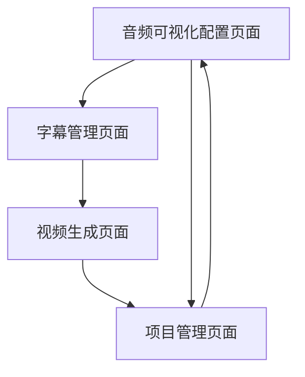

# Audiogram Maker 产品需求文档

## 1. 产品概述

Audiogram Maker 是一个基于 Remotion 的音频可视化视频生成工具，专门用于将播客、音频片段转换为适合社交媒体分享的可视化视频内容。
- 解决播客和音频内容在社交媒体平台上缺乏视觉吸引力的问题，帮助内容创作者扩大音频内容的传播范围。
- 目标用户包括播客制作人、音频内容创作者、社交媒体营销人员等需要将音频内容可视化的专业人士。
- 产品价值在于提供专业级的音频可视化解决方案，提升音频内容在视觉平台上的表现力和传播效果。

## 2. 核心功能

### 2.1 用户角色

| 角色 | 注册方式 | 核心权限 |
|------|----------|----------|
| 内容创作者 | 本地使用，无需注册 | 可使用所有音频可视化功能，生成和导出视频 |

### 2.2 功能模块

我们的音频图生成器包含以下主要功能页面：
1. **音频可视化配置页面**：音频文件上传、可视化参数设置、预览功能
2. **字幕管理页面**：字幕文件导入、自动转录、字幕样式配置
3. **视频生成页面**：渲染设置、导出配置、批量处理
4. **项目管理页面**：项目保存、模板管理、历史记录

### 2.3 页面详情

| 页面名称 | 模块名称 | 功能描述 |
|----------|----------|----------|
| 音频可视化配置页面 | 音频上传模块 | 支持多种音频格式上传，自动解析音频时长和基本信息 |
| 音频可视化配置页面 | 可视化设置模块 | 提供示波器和频谱图两种可视化模式，支持颜色、样本数量、窗口时间等参数调节 |
| 音频可视化配置页面 | 封面设置模块 | 上传播客封面图片，设置标题文本和颜色样式 |
| 字幕管理页面 | 字幕导入模块 | 支持 SRT 和 JSON 格式字幕文件导入，兼容多种字幕格式 |
| 字幕管理页面 | 自动转录模块 | 集成 Whisper 语音识别，支持多语言音频自动转录生成字幕 |
| 字幕管理页面 | 字幕样式模块 | 设置字幕颜色、字体大小、显示模式（当前句子或全部显示） |
| 视频生成页面 | 渲染配置模块 | 设置视频分辨率、帧率、音频偏移等渲染参数 |
| 视频生成页面 | 导出设置模块 | 选择输出格式、质量设置、文件命名规则 |
| 项目管理页面 | 项目保存模块 | 保存当前配置为项目文件，支持项目的加载和编辑 |
| 项目管理页面 | 模板管理模块 | 创建和管理可重用的样式模板，快速应用到新项目 |

## 3. 核心流程

**主要用户操作流程：**

用户首先在音频可视化配置页面上传音频文件并设置基本的可视化参数，然后进入字幕管理页面导入现有字幕或使用自动转录功能生成字幕，接着在视频生成页面配置渲染参数并开始生成视频，最后可以在项目管理页面保存项目配置以便后续使用。

## 4. 用户界面设计

### 4.1 设计风格

- **主色调**：深色主题 (#000000) 配合亮色强调色 (#F4B941)
- **次要颜色**：灰色系 (#BABABA) 用于文本和次要元素
- **按钮样式**：圆角矩形按钮，支持悬停和点击状态
- **字体**：系统默认字体，标题使用 48px，正文使用 16px
- **布局风格**：卡片式布局，顶部导航，响应式设计
- **图标风格**：简洁的线性图标，与音频、视频主题相关

### 4.2 页面设计概览

| 页面名称 | 模块名称 | UI 元素 |
|----------|----------|----------|
| 音频可视化配置页面 | 音频上传模块 | 拖拽上传区域，深色背景，黄色边框高亮，支持文件格式提示 |
| 音频可视化配置页面 | 可视化设置模块 | 参数调节滑块，实时预览窗口，颜色选择器使用卡片布局 |
| 字幕管理页面 | 字幕导入模块 | 文件选择按钮，字幕预览区域，支持拖拽导入 |
| 字幕管理页面 | 自动转录模块 | 进度条显示，语言选择下拉菜单，开始转录按钮 |
| 视频生成页面 | 渲染配置模块 | 参数设置表单，预设选项卡片，实时预览功能 |
| 项目管理页面 | 项目保存模块 | 项目列表网格布局，缩略图预览，操作按钮组 |

### 4.3 响应式设计

产品采用桌面优先的设计策略，针对 1080x1080 的视频输出格式进行优化，同时支持不同屏幕尺寸的适配，确保在各种设备上都能提供良好的用户体验。