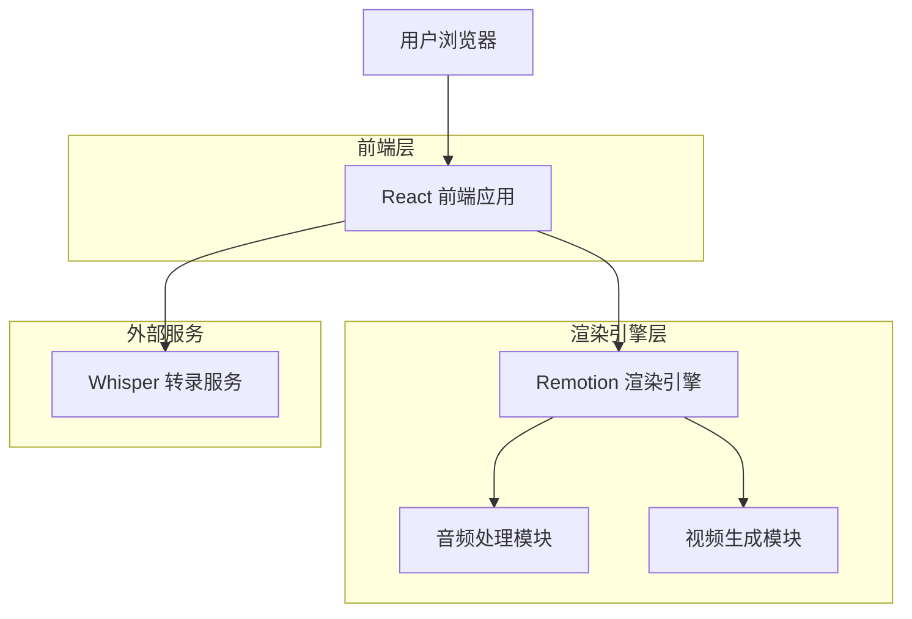
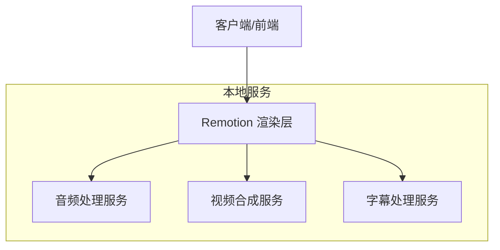
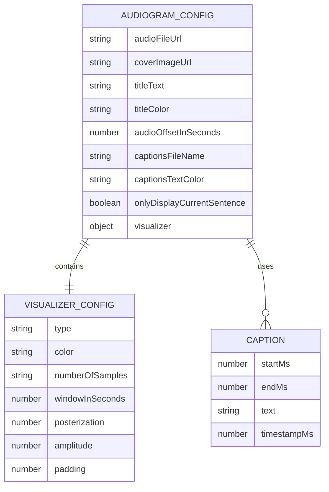

# Audiogram Maker 技术架构文档

## 1. 架构设计



## 2. 技术描述

- 前端：React@19 + TypeScript + Remotion@4
- 音频处理：@remotion/media-utils + @remotion/media-parser
- 转录服务：@remotion/install-whisper-cpp
- 字幕处理：@remotion/captions
- 构建工具：TypeScript@5.8.2
- 代码规范：ESLint + Prettier

## 3. 路由定义

| 路由 | 用途 |
|------|------|
| / | 主页面，Remotion Studio 开发环境 |
| /audiogram | 音频图组合页面，核心渲染组件 |

## 4. API 定义

### 4.1 核心 API

**音频文件处理**
```typescript
// 音频元数据解析
parseMedia({
  src: string,
  acknowledgeRemotionLicense: boolean,
  fields: {
    slowDurationInSeconds: boolean
  }
}): Promise<{
  slowDurationInSeconds: number
}>
```

**字幕数据获取**
```typescript
// 字幕文件读取
getSubtitles(captionsFileName: string): Promise<Caption[]>

// Caption 类型定义
interface Caption {
  startMs: number;
  endMs: number;
  text: string;
  timestampMs?: number;
}
```

**音频可视化**
```typescript
// 音频波形可视化
visualizeAudioWaveform({
  fps: number,
  frame: number,
  audioData: AudioData,
  numberOfSamples: number,
  windowInSeconds: number,
  channel: number,
  dataOffsetInSeconds: number
}): number[]
```

**转录服务**
```typescript
// 音频转录
transcribe({
  model: WhisperModel,
  whisperPath: string,
  inputPath: string,
  tokenLevelTimestamps: boolean,
  language: Language,
  whisperCppVersion: string
}): Promise<WhisperCppOutput>
```

## 5. 服务器架构图



## 6. 数据模型

### 6.1 数据模型定义



### 6.2 数据定义语言

**音频图配置 Schema**
```typescript
// 可视化器配置
const baseVisualizerSchema = z.object({
  color: zColor(),
  numberOfSamples: z.enum(["32", "64", "128", "256", "512"]),
});

// 示波器配置
const oscilloscopeVisualizerSchema = baseVisualizerSchema.extend({
  type: z.literal("oscilloscope"),
  windowInSeconds: z.number().min(0.1).default(0.1),
  posterization: z.number().int().min(0.1).default(3),
  amplitude: z.number().int().min(0.1).default(4),
  padding: z.number().int().min(0).default(50),
});

// 频谱图配置
const spectrumVisualizerSchema = baseVisualizerSchema.extend({
  type: z.literal("spectrum"),
  linesToDisplay: z.number().int().min(0).default(65),
  freqRangeStartIndex: z.number().int().min(0).default(0),
  mirrorWave: z.boolean(),
});

// 主配置 Schema
export const audiogramSchema = z.object({
  // 可视化器设置
  visualizer: z.discriminatedUnion("type", [
    spectrumVisualizerSchema,
    oscilloscopeVisualizerSchema,
  ]),
  // 播客数据
  coverImageUrl: z.string(),
  titleText: z.string(),
  titleColor: zColor(),
  // 字幕设置
  captionsFileName: z.string().refine(
    (s) => s.endsWith(".srt") || s.endsWith(".json"),
    { message: "字幕文件必须是 .srt 或 .json 格式" }
  ),
  captionsTextColor: zColor(),
  onlyDisplayCurrentSentence: z.boolean(),
  // 音频设置
  audioFileUrl: z.string(),
  audioOffsetInSeconds: z.number().min(0),
});
```

**字幕数据结构**
```typescript
// 字幕条目接口
interface Caption {
  startMs: number;        // 开始时间（毫秒）
  endMs: number;          // 结束时间（毫秒）
  text: string;           // 字幕文本
  timestampMs?: number;   // 时间戳（可选）
}

// 转录选项接口
interface TranscriptionOptions {
  audioPath: string;              // 音频文件路径
  speechStartsAtSecond: number;   // 语音开始时间
  language?: Language;            // 识别语言
}
```

**组件属性类型**
```typescript
// 音频图组件属性
type AudiogramCompositionSchemaType = z.infer<typeof audiogramSchema> & {
  captions: Caption[] | null;
};

// 可视化器组件属性
interface OscilloscopeProps {
  audioSrc: string;
  padding: number;
  numberOfSamples: number;
  windowInSeconds: number;
  posterization: number;
  amplitude: number;
  waveColor: string;
}

interface SpectrumProps {
  barColor: string;
  audioSrc: string;
  mirrorWave: boolean;
  numberOfSamples: number;
  freqRangeStartIndex: number;
  waveLinesToDisplay: number;
}
```